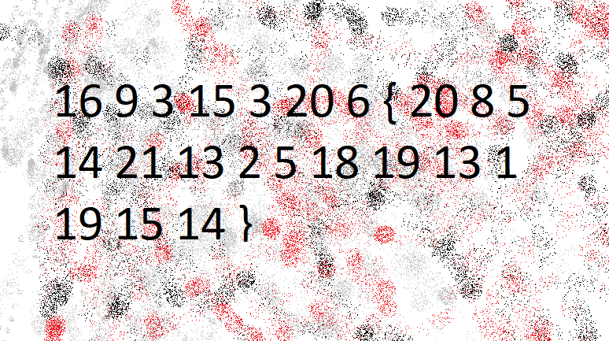

https://learn.cylabacademy.org/library/68?page=1&category=2

## 題目

The numbers... what do they mean?

[numbers.png](https://challenge-files.picoctf.net/c_fickle_tempest/7b39deba4212c233b1628c93f16639ed02ad90f51436d2a8914bb11f74a982d3/the_numbers.png)

## 提示
  
The flag is in the format PICOCTF{}

## 附檔



## 解題

數字代表第幾個英文字母。寫以下 python 進行解碼：

```python
enc = [16, 9, 3, 15, 3, 20, 6, '{', 20, 8, 5, 14, 21, 13, 2, 5 ,18, 19, 13, 1, 19, 15, 14, '}']

flag = ''
for i in enc:
    # 字元為 { or }
    if i == '{' or i == '}':
        flag += i
    else:
        flag += chr(ord('A') + i - 1)
print(flag)
```

輸出 flag :  
PICOCTF{THENUMBERSMASON}