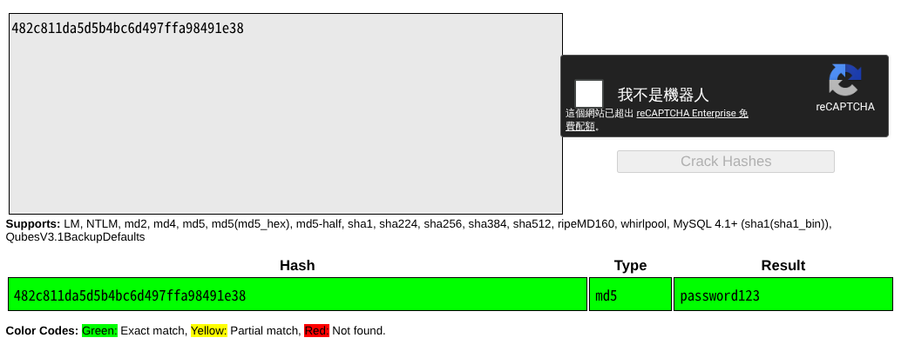

## 題目

A company stored a secret message on a server which got breached due to the admin using weakly hashed passwords. Can you gain access to the secret stored within the server?

Access the server using `nc verbal-sleep.picoctf.net 60046`


##  解題

先使用 `nc` 連線：
```bash
`nc verbal-sleep.picoctf.net 60046`

Welcome!! Looking For the Secret?

We have identified a hash: 482c811da5d5b4bc6d497ffa98491e38
Enter the password for identified hash: 
```

從題目可知是要爆破 Hash，以下提供一些解法。

### 解法 1（最簡單） ：CrackStation

只要需要爆破 Hash，推薦這個網站：[Crack Station](https://crackstation.net/) ，直接輸入 Hash ，就可以進行爆破了。上述的 Hash 爆破結果為：password123



之後依序爆破題目給的 Hash，就能拿到 Flag :
```bash
┌──(kali㉿kali)-[~/Downloads/temp]
└─$ nc verbal-sleep.picoctf.net 60046
Welcome!! Looking For the Secret?

We have identified a hash: 482c811da5d5b4bc6d497ffa98491e38
Enter the password for identified hash: password123
Correct! You've cracked the MD5 hash with no secret found!

Flag is yet to be revealed!! Crack this hash: b7a875fc1ea228b9061041b7cec4bd3c52ab3ce3
Enter the password for the identified hash: letmein
Correct! You've cracked the SHA-1 hash with no secret found!

Almost there!! Crack this hash: 916e8c4f79b25028c9e467f1eb8eee6d6bbdff965f9928310ad30a8d88697745
Enter the password for the identified hash: qwerty098
Correct! You've cracked the SHA-256 hash with a secret found. 
The flag is: picoCTF{UseStr0nG_h@shEs_&PaSswDs!_4de57566}
```

故 Flag :  
picoCTF{UseStr0nG_h@shEs_&PaSswDs!_4de57566}
