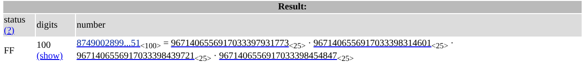

https://learn.cylabacademy.org/library/702?page=2&category=2

## 題目

A message has been encrypted using RSA, but this time something feels... more crowded than usual. Can you decrypt it?

Download the [message](https://challenge-files.picoctf.net/c_plain_mesa/fde442cb7c12627d523f5857fb388237eccb38f7a431ca7f8fd714a2ac78d910/message.txt).

## 附檔

**message.txt**

```css
n = 8749002899132047699790752490331099938058737706735201354674975134719667510377522805717156720453193651
e = 65537
ct = 3891158515405030211396309867177046660195995913985068178988858029936868358096672572274111514200511662
```

## 解題

>[RSA](../../筆記/RSA.md)

附檔 `message.txt` 中，可以看到 $n、e$ 都很小，故可以嘗試暴力猜測組成 $n$ 的質數。

註：本題 RSA 的 $n$ 是由四個質數組成，故 
$$\boxed{\phi (n) =(p_1-1)(p_2-1)(p_3-1)(p_4-1)}$$

**Step 1 : 到 FactorDB 分解 n**

直接到 [FactorDB](https://factordb.com/) 分解 $n$ ，得到組成 $n$ 的四個質數：


**Step 2 : 解出私鑰**

$p_1=9671406556917033397931773$  
$p_2=9671406556917033398314601$  
$p_3=9671406556917033398439721$  
$p_4=9671406556917033398454847$

1. $n=p_1\times p_2 \times p_3 \times p_4$
2. $\phi (n) =(p_1-1)(p_2-1)(p_3-1)(p_4-1)$
3. $d=e^{-1}\mod \phi(n)$
4. $m=c^d\mod n$

#### 完整程式

```python
n = 8749002899132047699790752490331099938058737706735201354674975134719667510377522805717156720453193651
e = 65537
ct = 3891158515405030211396309867177046660195995913985068178988858029936868358096672572274111514200511662

primes = [
    9671406556917033397931773,
    9671406556917033398314601,
    9671406556917033398439721,
    9671406556917033398454847
]

# 計算 phi
phi = 1
for p in primes:
    phi *= (p - 1) 

# 計算私鑰 d
d = pow(e, -1, phi)

# 解密
m = pow(ct, d, n)

print(bytes.fromhex(hex(m).replace('0x', '')))
```

