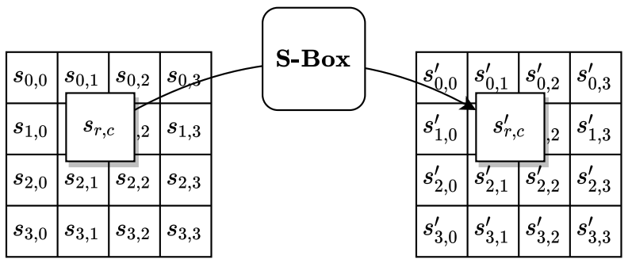
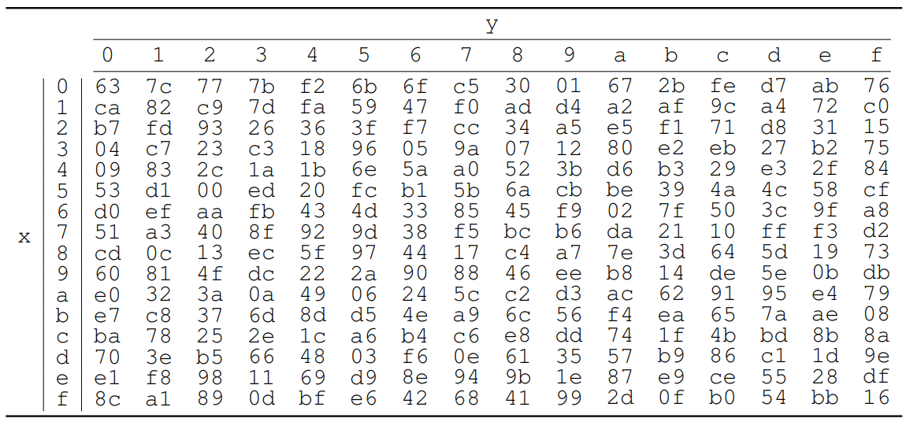
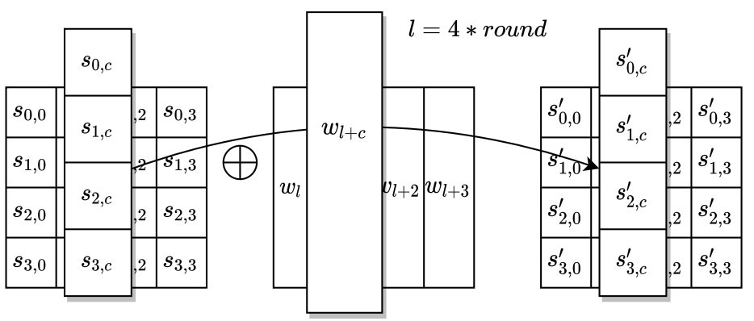
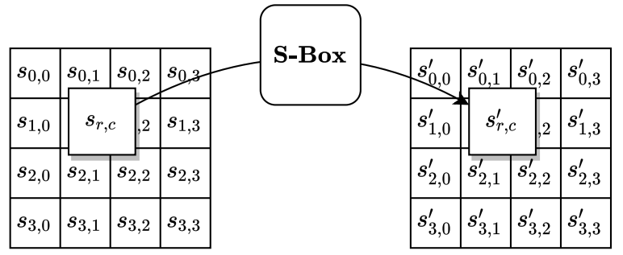
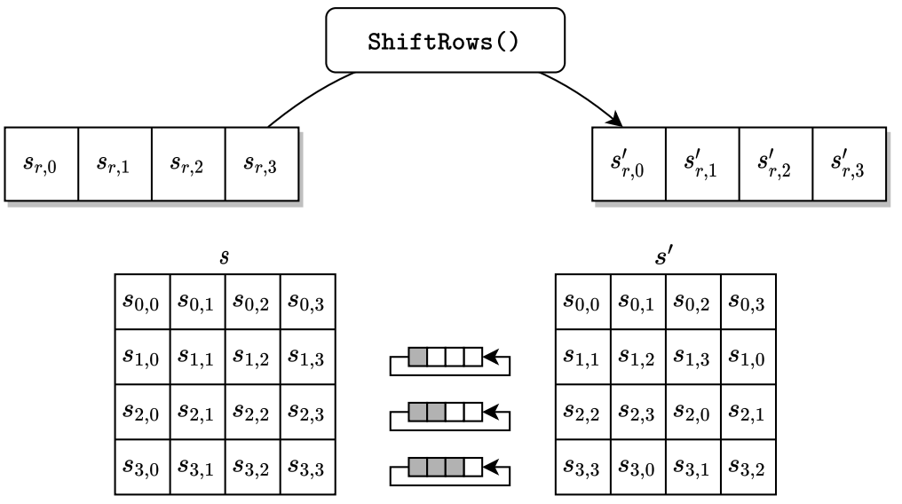
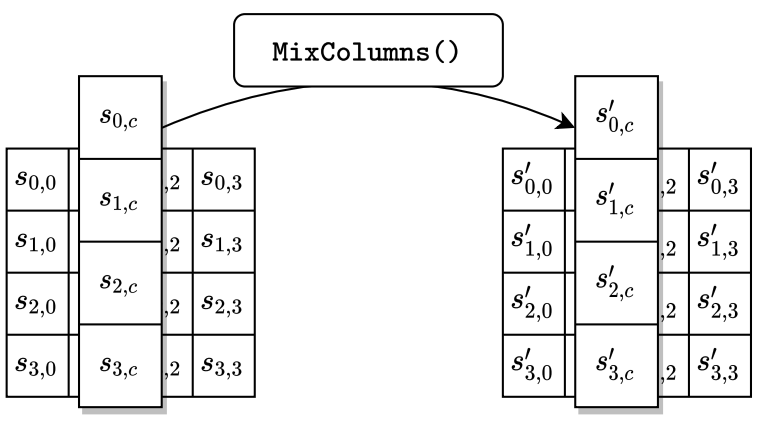
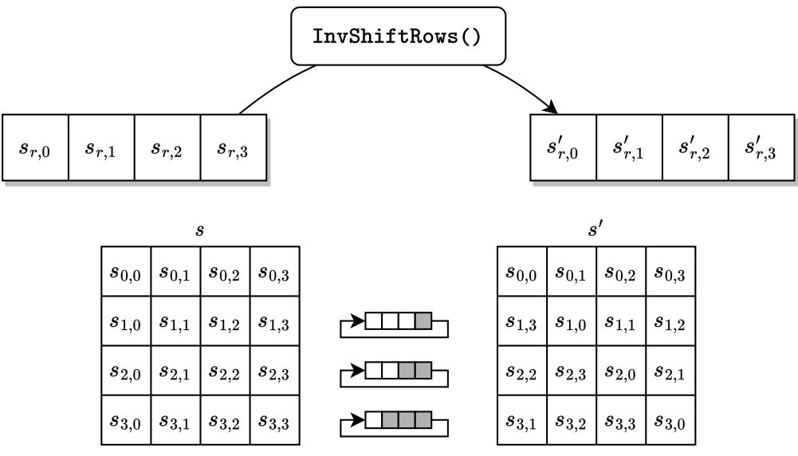
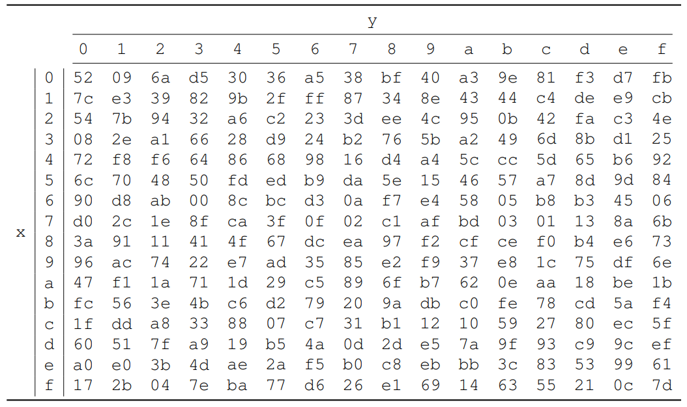

Ref : https://nvlpubs.nist.gov/nistpubs/FIPS/NIST.FIPS.197-upd1.pdf

- [\\end{bmatrix}](#endbmatrix)
		- [加密](#加密)
			- [Algorithm](#algorithm)
				- [KEYEXPANSION](#keyexpansion)
					- [概念](#概念)
					- [定義](#定義)
					- [Pseudocode](#pseudocode)
				- [ADDROUNDKEY](#addroundkey)
				- [SUBBYTES](#subbytes)
				- [SHIFTROWS](#shiftrows)
				- [MIXCOLUMNS](#mixcolumns)
- [\\end{bmatrix}](#endbmatrix-1)
		- [解密](#解密)
			- [Algorithm - INVCIPHER](#algorithm---invcipher)
				- [INVSHIFTROWS](#invshiftrows)
				- [INVSUBBYTES](#invsubbytes)
				- [INVMIXCOLUMNS](#invmixcolumns)
- [\\end{bmatrix}](#endbmatrix-2)
			- [Algorighm - EQUINVCIPHER](#algorighm---equinvcipher)
				- [Pseudocode](#pseudocode-1)
	- [使用 Python](#使用-python)
		- [install package](#install-package)
		- [code](#code)

## AES 演算法
### 基本定義

- **block**
  $128\ bits$。AES 的輸入與輸出單位都是 block。

- $\color{pink}{in}$
  表示輸入 block

- $\color{pink}{key}$
  金鑰
  
- **state**
  以 $s$ 表示。AES 演算法是在稱為 $state$ 的二維 $(4×4)$ 陣列上執行，每個矩陣元素為 $1\ Byte$
```math
\begin{bmatrix}
s_{0, 0}\ , s_{0, 1}\ , s_{0, 2}\ , s_{0, 3}\\
s_{1, 0}\ , s_{1, 1}\ , s_{1, 2}\ , s_{1, 3}\\
s_{2, 0}\ , s_{2, 1}\ , s_{2, 2}\ , s_{2, 3}\\
s_{3, 0}\ , s_{3, 1}\ , s_{3, 2}\ , s_{3, 3}\\
\end{bmatrix}
```
- **word**
  $4\ Bytes$ 。例如 $state$ 是由 $4\ words$ 組成：
```math
v_0=
\begin{bmatrix}
s_{0, 0}\\
s_{1, 0}\\
s_{2, 0}\\
s_{3, 0}
\end{bmatrix}
\ \ \ \ \ 
v_1=
\begin{bmatrix}
s_{0, 1}\\
s_{1, 1}\\
s_{2, 1}\\
s_{3, 1}
\end{bmatrix}
\ \ \ \ \ 
v_2=
\begin{bmatrix}
s_{0, 2}\\
s_{1, 2}\\
s_{2, 2}\\
s_{3, 2}
\end{bmatrix}
\ \ \ \ \ 
v_3=
\begin{bmatrix}
s_{0, 3}\\
s_{1, 3}\\
s_{2, 3}\\
s_{3, 3}
\end{bmatrix}
```

- **使用多項式表示 byte**
  假設 byte { $b_7, b_6, b_5, b_4, b_3, b_2, b_1, b_0$ } ，使用多項式表示：
```math
b(x)=b_7x^7 + b_6x^6 + b_5x^5 + b_4x^4 + b_3x^3 + b_2x^2 + b_1x + b_0
```
  例如： $\{01100011\}$ 使用多項式表示 → $x^6+x^5+x+1$

- **加法**
    ```math
    \begin{flalign*}
    &(x^6+x^4+x^2+x+1)+(x^7+x+1)=x^7+x^6+x^4+x^2 \hfill &&(多項式)\\
    &\{01010111\} \oplus \{10000011\}=\{11010100\}\hfill &&(binary)\\
    &\{57\} \oplus \{83\} = \{d4\} \hfill  &&(hexadecimal)
    \end{flalign*}
    ```

- **乘法**
  假設兩個 bytes： $b(x)、c(x)$
  則乘法 $b \cdot c$ ：
  ```math
  b(x)c(x)\ \ \mod m(x)
  ```
  其中 $\color{yellow}{m(x)=x^8+x^4+x^3+x+1}$

- **乘法反元素**
```math
\begin{aligned}
b \cdot b^{-1} &= \{01\} \\
b^{-1}&=b^{254}
\end{aligned}
```
  可利用擴展歐基里得解出 $a(x)$ ，即為 $b^{-1}$
  ```math
  b(x)a(x)+m(x)c(x)=1
  ```

- **SBOX**  
  
  
	- $\boxed{轉換對照表}$
	  假設 $s_{r, c}=\{53\}$，則 $s^\prime_{r, c}=SBOX(s_{r, c})=\{ed\}$  
	  
	
	- $\boxed{數學表示}$
		- $c=\{01100011\}$
		- $\tilde{b}$ 定義如下：
	  ```math
	  \tilde{b}=\begin{cases}\{00\}\ \ \ , if\ \ b=\{00\}\\b^{-1}\ \ \ ,\ \ if\ \ b\ne\{00\} \end{cases}
	  ```
		- 假設輸入 byte 為 $b$ ，則：
            ```math
            \begin{aligned}
            &b^\prime =SBOX(b)\\
            &b^\prime _i=\tilde{b}_i\ 
            \oplus \ \tilde{b}_{(i+4)\mod 8}\ 
            \oplus \ \tilde{b}_{(i+5)\mod 8}\ 
            \oplus \ \tilde{b}_{(i+6)\mod 8}\ 
            \oplus \ \tilde{b}_{(i+7)\mod 8}\ 
            \oplus \ c_i
            \end{aligned}
            ```
		- 使用矩陣運算表示：
```math
\begin{bmatrix}
b^\prime_0\\
b^\prime_1\\
b^\prime_2\\
b^\prime_3\\
b^\prime_4\\
b^\prime_5\\
b^\prime_6\\
b^\prime_7\\
\end{bmatrix}
=
\begin{bmatrix}
1\ 0\ 0\ 0\ 1\ 1\ 1\ 1\ \\
1\ 1\ 0\ 0\ 0\ 1\ 1\ 1\ \\
1\ 1\ 1\ 0\ 0\ 0\ 1\ 1\ \\
1\ 1\ 1\ 1\ 0\ 0\ 0\ 1\ \\
1\ 1\ 1\ 1\ 1\ 0\ 0\ 0\ \\
0\ 1\ 1\ 1\ 1\ 1\ 0\ 0\ \\
0\ 0\ 1\ 1\ 1\ 1\ 1\ 0\ \\
0\ 0\ 0\ 1\ 1\ 1\ 1\ 1\ \\
\end{bmatrix}
\begin{bmatrix}
\tilde{b}_0\\
\tilde{b}_1\\
\tilde{b}_2\\
\tilde{b}_3\\
\tilde{b}_4\\
\tilde{b}_5\\
\tilde{b}_6\\
\tilde{b}_7\\
\end{bmatrix}
+
\begin{bmatrix}
1\\
1\\
0\\
0\\
0\\
1\\
1\\
0
\end{bmatrix}
```

### 加密

分為 AES-128、AES-192、AES-256，其運算時的 Block Size 皆為 **128 bits** ，差異再於 Key Length、Round 次數。

- $Nk$ ：表示金鑰大小為 $Nk\ Words$
- $Nb$：表示 Block 大小為 $Nb\ Words$
- $Nr$：表示第幾輪

<table>
	<tr>
		<th rowspan="2"></th>
		<th colspan="2">Keh length</th>
		<th colspan="2">Block size</th>
		<th>輪數（rounds）</th>
	</tr>
	<tr>
		<th>Nk</th><th>bits</th>
		<th>Nb</th><th>bits</th>
		<th>Nr</th>
	</tr>
	<tr>
		<th>AES-128</th>
		<td>4</td><td>128</td>
		<td>4</td><td>128</td>
		<td>10</td>
	</tr>
	<tr>
		<th>AES-192</th>
		<td>6</td><td>192</td>
		<td>4</td><td>128</td>
		<td>12</td>
	</tr>
	<tr>
		<th>AES-256</th>
		<td>8</td><td>256</td>
		<td>4</td><td>128</td>
		<td>14</td>
	</tr>
</table>

#### Algorithm

```math
\begin{aligned}
AES-128(in, key)=CIPHER(in, 10, KEYEXPANSION(key))\\
AES-192(in, key)=CIPHER(in, 12, KEYEXPANSION(key))\\
AES-256(in, key)=CIPHER(in, 14, KEYEXPANSION(key))\\
\end{aligned}
```


```python
procedure CIPHER(in, Nr, w)
	state ⟵ in
	state ⟵ ADDROUNDKEY(state, w[0..3])
	for round from 1 to Nr - 1 do
		state ⟵ SUBBYTES(state)
		state ⟵ SHIFTROWS(state)
		state ⟵ MIXCOLUMNS(state)
		state ⟵ ADDROUNDKEY(state, w[4*round..4*round+3])
	end for
	state ⟵ SUBBYTES(state)
	state ⟵ SHIFTROWS(state)
	state ⟵ ADDROUNDKEY(state, w[4*Nr..4*Nr+3])
	return state
end procedure
```

##### KEYEXPANSION

###### 概念
- 用來生成 $w$ ，也就是 round key。
- 使用 $w[i]$ 表示第 $i$ 把 round key
- 其會利用金鑰 $key$ 產生 $4*(Nr+1)$  words，也就是 $(Nr+1)$ 把 round key

###### 定義

- 假設 $a_i$ 為 1 Byte，給定一個 word : $[a_0, a_1, a_2, a_3]$ ，則：
	- $ROTWORD([a_0, a_1, a_2, a_3])=[a_1, a_2, a_3, a_0]$
	- $SUBWORD(a_0, a_1, a_2, a_3))=[SBOX(a_0), SBOX(a_1), SBOX(a_2), SBOX(a_3)]$
- **Round Constants**  
```math
\begin{aligned}
Rcon[1]=[01, 00, 00, 00]\\
Rcon[2]=[02, 00, 00, 00]\\
Rcon[3]=[04, 00, 00, 00]\\
Rcon[4]=[08, 00, 00, 00]\\
Rcon[5]=[10, 00, 00, 00]\\
Rcon[6]=[20, 00, 00, 00]\\
Rcon[7]=[40, 00, 00, 00]\\
Rcon[8]=[80, 00, 00, 00]\\
Rcon[9]=[1b, 00, 00, 00]\\
Rcon[10]=[36, 00, 00, 00]\\
\end{aligned}
```

###### Pseudocode

```python
procedure KEYEXPANSION()
	i ⟵ 0
	while i <= Nk - 1 do
		w[i] ⟵ key[4*i .. 4*i+3]
		i ⟵ i + 1
	end while
	while i <= 4*Nr + 3 do
		temp ⟵ w[i - 1]
		if i mod Nk = 0 then
			temp ⟵ SUBWORD(ROTWORD(temp)) ⨁ Rcon[i/Nk]
		else if Nk > 6 and i mod Nk = 4 then
			temp ⟵ SUBWORD(temp)
		end if
		w[i] ⟵ w[i - Nk] ⨁ temp
		i ⟵ i + 1
	end while
	return w
end procedure
```


##### ADDROUNDKEY

`KEYEXPANSION` 後，會產生 $4*(Nr+1)$  words，也就是 $(Nr+1)$ 把 round key，以 $w[i]$ 表示。
`ADDROUNDKEY` 會將 $w[i]$ 與 $state$ 的 word 做運算：
```math
\begin{flalign*}
&[s^\prime_{0, c}\ \ , \ \ s^\prime_{1, c}\ \ , \ \ s^\prime_{2, c}\ \ , \ \ s^\prime_{3, c}]=[s_{0, c}\ \ , \ \ s_{1, c}\ \ , \ \ s_{2, c}\ \ , \ \ s_{3, c}]
\ \oplus \ [w_{4*round+c}] 
&& for\ \ 0\leq c < 4
\end{flalign*}
```




##### SUBBYTES

$state$ 中的每個 byte 使用 $SBOX$ 進行替換




##### SHIFTROWS

將 $state$ 的後三個 row 進行位移，位移規則如下：
```math
s^\prime_{r, c}=s_{r, (c+r)\mod 4}
\ \ \ \ \ \ \ for\ 0 \leq r < 4\ and \ 0 \leq c < 4
```




##### MIXCOLUMNS

讓 $state$ 的四個 column 乘上一個固定矩陣：

```math
\begin{bmatrix}
s^\prime_{0, c}\\
s^\prime_{1, c}\\
s^\prime_{2, c}\\
s^\prime_{3, c}\\
\end{bmatrix}
=
\begin{bmatrix}
02\ \ 03\ \ 01\ \ 01\\
01\ \ 02\ \ 03\ \ 01\\
01\ \ 01\ \ 02\ \ 03\\
03\ \ 01\ \ 01\ \ 02\\
\end{bmatrix}
\begin{bmatrix}
s_{0, c}\\
s_{1, c}\\
s_{2, c}\\
s_{3, c}\\
\end{bmatrix}
\ \ \ \ \ for\ \ 0 \leq c < 4
```
```math
\begin{aligned}
s^\prime_{0, c}=
(\{02\} \cdot s_{0, c})\ \oplus \ 
(\{03\} \cdot s_{1, c}) \ \oplus \ 
s_{2, c}\ \oplus \ 
s_{3, c}\\
s^\prime_{1, c}=
s_{0, c}\ \oplus \ 
(\{02\} \cdot s_{1, c})\ \oplus \ 
(\{03\} \cdot s_{2, c}) \ \oplus \ 
s_{3, c}\\
s^\prime_{2, c}=
s_{0, c}\ \oplus \ 
s_{1, c}\ \oplus \ 
(\{02\} \cdot s_{2, c})\ \oplus \ 
(\{03\} \cdot s_{3, c})\\
s^\prime_{3, c}=
(\{03\} \cdot s_{0, c})\ \oplus \ 
s_{1, c}\ \oplus \ 
s_{2, c}\ \oplus \ 
(\{02\} \cdot s_{3, c})\\
\end{aligned}
```




### 解密

#### Algorithm - INVCIPHER

```python
procedure INVCIPHER(in, Nr, w)
	state ⟵ in
	state ⟵ ADDROUNDKEY(state, w[4*Nr .. 4*Nr + 3])
	for round from Nr - 1 downto 1 do
		state ⟵ INVSHIFTROWS(state)
		state ⟵ INVSUBBYTES(state)
		state ⟵ ADDROUNDKEY(state, w[4*round .. 4*round + 3])
		state ⟵ INVMIXCOLUMNS(state)
	end for
	state ⟵ INVSHIFTROWS(state)
	state ⟵ INVSUBBYTES(state)
	state ⟵ ADDROUNDKEY(state), w[0..3]
	return state
end procedure
```


##### INVSHIFTROWS

對後三 row 的 byte 進行位移，規則如下：
```math
s^\prime_{r, c}=s_{r, (c-r)\mod 4}
\ \ \ \ \ \ \ for\ 0 \leq r < 4\ and \ 0 \leq c < 4
```




##### INVSUBBYTES

對 $state$ 中的每個 byte ，使用 INVSBOX 進行置換， INVSBOX 如下：




##### INVMIXCOLUMNS

將 $state$ 中的四個 Column 乘上一個固定矩陣：

```math
\begin{bmatrix}
s^\prime_{0, c}\\
s^\prime_{1, c}\\
s^\prime_{2, c}\\
s^\prime_{3, c}\\
\end{bmatrix}
=
\begin{bmatrix}
0e\ \ 0b\ \ 0d\ \ 09\\
09\ \ 0e\ \ 0b\ \ 0d\\
0d\ \ 09\ \ 0e\ \ 0b\\
0b\ \ 0d\ \ 09\ \ 0e\\
\end{bmatrix}
\begin{bmatrix}
s_{0, c}\\
s_{1, c}\\
s_{2, c}\\
s_{3, c}\\
\end{bmatrix}
\ \ \ \ \ for\ \ 0 \leq c < 4
```
```math
\begin{aligned}
s^\prime_{0, c}=
(\{0e\} \cdot s_{0, c})\ \oplus \ 
(\{0b\} \cdot s_{1, c}) \ \oplus \ 
(\{0d\} \cdot s_{2, c}) \ \oplus \ 
(\{09\} \cdot s_{3, c})\\
s^\prime_{1, c}=
(\{09\} \cdot s_{0, c})\ \oplus \ 
(\{0e\} \cdot s_{1, c}) \ \oplus \ 
(\{0b\} \cdot s_{2, c}) \ \oplus \ 
(\{0d\} \cdot s_{3, c})\\
s^\prime_{2, c}=
(\{0d\} \cdot s_{0, c})\ \oplus \ 
(\{09\} \cdot s_{1, c}) \ \oplus \ 
(\{0e\} \cdot s_{2, c}) \ \oplus \ 
(\{0b\} \cdot s_{3, c})\\
s^\prime_{3, c}=
(\{0b\} \cdot s_{0, c})\ \oplus \ 
(\{0d\} \cdot s_{1, c}) \ \oplus \ 
(\{09\} \cdot s_{2, c}) \ \oplus \ 
(\{0e\} \cdot s_{3, c})\\
\end{aligned}
```

#### Algorighm - EQUINVCIPHER

比 `INVCIPHER` 更有效率。

##### Pseudocode

```python
procedure EQUINVCIPHER(in, Nr, dw)
	state ⟵ in
	state ⟵ ADDROUNDKEY(state, dw[4*Nr .. 4*Nr+3])
	for round from Nr - 1 downto 1 do
		state ⟵ INVSUBBYTES(state)
		state ⟵ INVSHIFTROWS(state)
		state ⟵ INVMIXCOLUMNS(state)
		state ⟵ ADDROUNDKEY(state, dw[4*round .. 4*round + 3])
	end for
	state ⟵ INVSUBBYTES(state)
	state ⟵ INVSHIFTROWS(state)
	state ⟵ ADDROUNDKEY(state, dw[0..3])
	return state
end procedure
```

其中 $dw$ 使用 `KEYEXPANSIONEIC` 生成，如下：

```python
procedure KEYEXPANSIONEIC(key)
	i ⟵ 0
	while i <= Nk - 1 do
		w[i] ⟵ key[4i .. 4i + 3]
		dw[i] ⟵ w[i]
		i ⟵ i + 1
	end while
	while i <= 4*Nr + 3 do
		temp ⟵ w[i - 1]
		if i mod Nk = 0 then
			temp ⟵ SUBWORD(ROTWORD(temp)) ⨁ Rcon[i/Nk]
		else if Nk > 6 and i mod Nk = 4 then
			temp ⟵ SUBWORD(temp)
		end if
		w[i] ⟵ w[i - Nk] ⨁ temp
		dw[i] ⟵ w[i]
		i ⟵ i + 1
	end while
	for round from 1 to Nr - 1 do
		i ⟵ 4*round
		dw[i..i+3] ⟵ INVMIXCOLUMNS(dw[i .. i+3])
	end for
	return dw
end procedure
```

## 使用 Python

### install package

```bash
pip install pycryptodome
```


### code

```python
from Crypto.Cipher import AES
from Crypto.Util.Padding import pad, unpad

# AES key 必須是：
# 16 bytes = AES-128
# 24 bytes = AES-192
# 32 bytes = AES-256
key = b"1234567890abcdef"

plaintext = "Hello AES! 你好"

# =====================
# 加密
# =====================

cipher = AES.new(key, AES.MODE_ECB)

ciphertext = cipher.encrypt(
    pad(plaintext.encode("utf-8"), AES.block_size)
)

print("Ciphertext bytes:", ciphertext)
print("Ciphertext hex:", ciphertext.hex())


# =====================
# 解密
# =====================

cipher = AES.new(key, AES.MODE_ECB)

decrypted = unpad(
    cipher.decrypt(ciphertext),
    AES.block_size
)

print("Decrypted bytes:", decrypted)
print("Decrypted text:", decrypted.decode("utf-8"))
```

