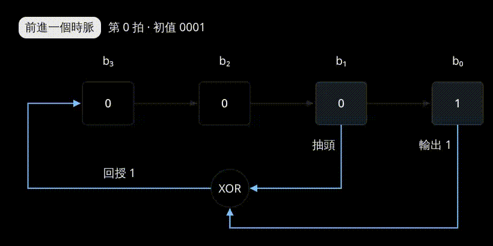

## 核心概念

**每次將位元移動一格，再根據原本的部分位元，計算出要補進去的新位元**


$\boxed{例子}$  以 4 bits 、向右位移的 LFSR 為例：

目前位元：
```math
\begin{bmatrix}
b_3, b_2, b_1, b_0
\end{bmatrix}
```
選擇 $b_1$ 、 $b_0$ 當作 **taps** ，用來計算要補的新 bit value。

每次時脈觸發時：
1. 計算 feedback bit :  
```math
f=b_0\ \oplus \ b_1
```
2. 所有位元向右位移一格，原本的 $b_0$ 做為這一拍的輸出  
```math
\begin{aligned}
\begin{bmatrix}
\boxed{　}\ , b_3, b_2, b_1
\end{bmatrix}\\\\
output : b_0
\end{aligned}
```
3. 將 $f$ 補入做左側  
```math
\begin{bmatrix}
f, b_3, b_2, b_1
\end{bmatrix}
```



## 特性

- **序列會重複**
  狀態數有限，且每個狀態的下一步都已確定，因此最終一定進入循環
  
- **週期取決於 Taps**
  對於一般 $n$ 位元的 LFSR，最大週期是 $2^n-1$ 。要達到最大週期， Taps 所對應的 Feedback 多項式必須是「Primitive Polynomial」，且種子不能全為 0
  
- **全 0 會卡住**
  `0000` 的 Feedback 永遠是 `0`
  
- **結果可以重現**
  相同 Taps 與種子，一定產生相同序列

