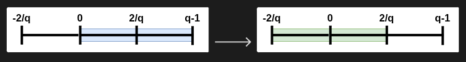

- [1. 建立公鑰](#1-建立公鑰)
  - [(1) 選定參數 N、p、q](#1-選定參數-npq)
  - [(2) 隨機產生兩個多項式 $f、g$](#2-隨機產生兩個多項式-fg)
  - [(3) 建立公鑰 h](#3-建立公鑰-h)
- [2. 加密](#2-加密)
- [3. 解密](#3-解密)
  - [(1) 計算 a = fe mod q](#1-計算-a--fepmod-q)
  - [(2) 計算 f_p^{-1}a mod p](#2-計算-f_p-1amod-p)
- [Center Lift](#center-lift)
- [LLL 攻擊](#lll-攻擊)
  - [NTRU 格](#ntru-格)
    - [為什麼會出現循環矩陣？](#為什麼會出現循環矩陣)

<hr>

## 1. 建立公鑰

### (1) 選定參數 $N、p、q$

- 運算所在的[多項式環](../筆記/多項式環.md)為  $\color{yellow}{R=\mathbb Z[x]/(x^N-1)}$ ，也就是 $x$ 最高次數為 $x^{47}$ ，並且所有多項式係數皆為整數。

- $p、q$ 不一定要是質數，但彼此必須 **互質** ，且通常 $p \ll q$ 。

- 範例參數：  
$N=48,\qquad p=3,\qquad q=509$

### (2) 隨機產生兩個多項式 $f、g$

- $f$ 、$g$ 皆在多項式環 $\color{yellow}{R=\mathbb Z[x]/(x^N-1)}$ 內
  
- $f$ 必須滿足以下條件：  
  $f$ 在模 $p$ 與模 $q$ 下，存在反元素 $f_p^{-1}$、 $f_q^{-1}$
	- $f\cdot f_p^{-1}\equiv1\pmod p$
	- $f\cdot f_q^{-1}\equiv1\pmod q$
	  

### (3) 建立公鑰 $h$

$$\boxed{h=pf_q^{-1}g\pmod q}\ \ \ 或\ \ \ \boxed{h=f_q^{-1}g\pmod q} $$


## 2. 加密

- 將明文 $m$ 轉成多項式 $m(x)$
  例如：
	  明文 $m$ 為 'a'，字元 a 的 ASCII Code = 97，將 97 轉成二進位：1100001 
	  假設 $N$ 為 48 ，則 1100001 因為長度只有 7 ，故須在尾端補 0 ，直到長度為 48，也就是： **1100001**000.....0000 。若明文長度超過 $N$，就須每 $N$ 個 bit 切成一組。
	  接下來轉成多項式，以 1100001 、$N$ = 48 為例，轉成多項式後：
	  $$1 + x+x^6$$
  
  
- 每次加密時，隨機產生一個小多項式：$r(x)$ 
  
- 加密：
```math
\boxed{e=rh+m\pmod q}
```

## 3. 解密

使用私鑰 $f$ 解密。

### (1) 計算 $a = fe\pmod q$

```math
\begin{aligned}
a&=fe\pmod q\\
&=f(rh+m)\pmod q\\
&=frh+fm\pmod q\\
&=fr(pf_q^{-1}g)+fm\pmod q\\
&=rpg+fm\pmod q

\end{aligned}
```

### (2) 計算 $f_p^{-1}a\mod p$ 

由於：
$$rpg\mod p = 0$$
故：

```math
\begin{aligned}
a \equiv fm\pmod p\\
f_p^{-1}a \equiv f_p^{-1}fm\pmod p\\
\boxed{f_p^{-1}a\equiv m\pmod p}
\end{aligned}
```


## Center Lift

有些 NTRU 會做 Center Lift。

得到： $a=prg+fm\pmod q$

若直接 $\mod q$ ，負數會變成很大的正數。

例如： $q=509$

則：
- $-1\equiv508\pmod{509}$
- $-2\equiv507\pmod{509}$

所以 NTRU 會進行 **center lift**。

把係數從 $0,1,\ldots,q-1$ 轉換成 $-\frac q2 < a_i\leq \frac q2$

對 $q=509$：  
```math
-254\leq a_i\leq254
```


例如：

| mod 509 值 | Center Lift |
| --------: | ----------: |
|         0 |           0 |
|         1 |           1 |
|         2 |           2 |
|       254 |         254 |
|       255 |        -254 |
|       507 |          -2 |
|       508 |          -1 |

所以：
$$508\rightarrow-1$$


## LLL 攻擊

NTRU 把私鑰藏成某個高維格中的異常短向量；LLL 可以把格基底縮短，因此有機會找出私鑰或可代替私鑰解密的短向量。

>[晶格（Lattice）](../筆記/晶格（Lattice）.md)

### NTRU 格

在標準的 NTRU 基礎中，公開金鑰多項式 h 可以組成一個 2N × 2N 的分塊矩陣（Basis Matrix）：  
```math
\begin{pmatrix}
I_N, H\\
O, qI_N
\end{pmatrix}
```
其中：
- $H$ : 為 $h$ 的循環矩陣
- $I_N$ ：為 size = N 的單位矩陣
- $O$ ：為 $N\times N$ 的零矩陣


公鑰： 
$$h=pf_q^{-1}g\pmod q$$
兩邊乘上 $f$：
$$fh=pg\pmod q$$
**此時 LLL 的結果，前半段為可能的** $f$ **，後半段為** $pg$


又因為 $p$ 在模 $q$ 下可逆，故乘上 $p_q^{-1}$ ：
$$fhp_q^{-1}=g\pmod q$$
令：
$$\overline{h}=p_q^{-1}h\pmod q$$
則：
$$\boxed{f\overline{h}=g\pmod q}$$
**此時 LLL 的結果，前半段為可能的** $f$ **，後半段為** $g$

在 NTRU 裡，

$$f∗\overline{h}≡g \pmod q$$

其中的 $∗$ 不是一般數字乘法，也不是向量逐項相乘，而是環

$$R_q=(\mathbb Z/q\mathbb Z)[x]/(x^N-1)$$

中的循環卷積。

#### 為什麼會出現循環矩陣？

假設 $N=3$：

$$
\begin{aligned}
f=f_0+f_1x+f_2x^2\\
h=h_0+h_1x+h_2x^2
\end{aligned}
$$

因為在 $R_q$ 中：
$$x^3=1$$

所以兩個多項式相乘後，高次項會循環回來。例如：
$$x^3\rightarrow 1,\qquad x^4\rightarrow x$$

展開：

$$f\bar h = (f_0+f_1x+f_2x^2) (h_0+h_1x+h_2x^2)$$

整理並使用 $x^3=1$，得到：

$$
\begin{aligned} g_0&=h_0f_0+h_2f_1+h_1f_2\\ g_1&=h_1f_0+h_0f_1+h_2f_2\\ g_2&=h_2f_0+h_1f_1+h_0f_2 \end{aligned} \pmod q
$$

這三個方程式可以寫成：

$$\begin{pmatrix} h_0&h_2&h_1\\ h_1&h_0&h_2\\ h_2&h_1&h_0 \end{pmatrix} \begin{pmatrix} f_0\\ f_1\\ f_2 \end{pmatrix} \equiv \begin{pmatrix} g_0\\ g_1\\ g_2 \end{pmatrix} \pmod q$$

令

$$H= \begin{pmatrix} h_0&h_2&h_1\\ h_1&h_0&h_2\\ h_2&h_1&h_0 \end{pmatrix}$$

就有：

$$H\mathbf f\equiv \mathbf g\pmod q$$

這個 $H$ 就是 $\bar h$ 的循環矩陣。

每一欄都是 $\bar h$ 的循環位移，因為：

$$f\bar h = f_0\bar h+f_1(x\bar h)+f_2(x^2\bar h)$$

而乘以 $x$ 在模 $x^N-1$ 的環中，正好就是把係數循環移動。

