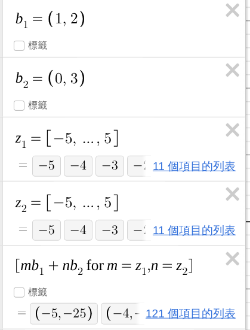
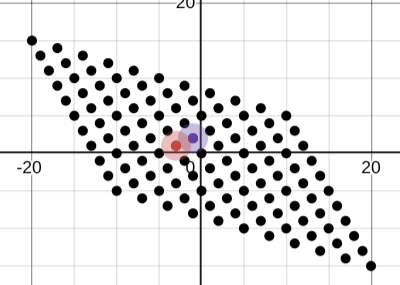
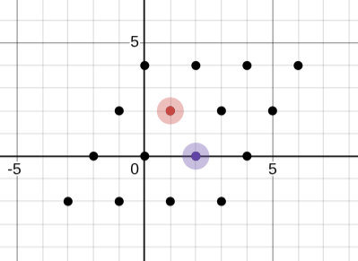

## 概要

從幾個固定方向的**基底向量**出發，只允許走「**整數**倍」，最後能到達的所有點所形成的集合。
格不是單一向量，也不是一個矩陣，而是由無限多個離散向量組成的集合。


可去[此網站](https://www.desmos.com/calculator/5mcnbkmu5f?lang=zh-TW) 繪製晶格範例：  



## 一維格

基底向量 $b_1=3$
只允許乘上整數： $L={ab_1:a \in \mathbb{Z}}$ 
所以 $L={..., -9, -6, -3, 0, 3, 6, 9, ...}$
這就是一維格： $L=3\mathbb{Z}$ 

## 二維格

選擇兩個基底向量：
```math
\begin{aligned}
b_1=(2, 0)\\
b_2=(1, 2)
\end{aligned}
```
定義：  
$$L={k_1b_1+k_2b_2：k_1, k_2 \in \mathbb{Z}}$$
展開後得到：  
$$(2k_1+k_2, 2k_2)$$  
只要選不同 $k_1, k_2$ 就會得到不同格向量：

| $k_1$ | $k_2$ | $k_1b_1+k_2b_2$ |
| ----: | ----: | --------------: |
|   $0$ |   $0$ |         $(0,0)$ |
|   $1$ |   $0$ |         $(2,0)$ |
|   $0$ |   $1$ |         $(1,2)$ |
|   $1$ |   $1$ |         $(3,2)$ |
|   $2$ |  $-1$ |        $(3,−2)$ |
|  $-1$ |   $2$ |         $(0,4)$ |



## 格向量

只要某個向量可以寫成：  
$$v=z_1b_1+z_2b_2+\dots+z_mb_m$$
其中所有 $z_i$ 都是整數，那麼：
$$v \in L$$
這個 $v$ 就稱為 **格向量**

## 使用矩陣表示格

把基底向量 $b_1(2, 0)、b_2(1, 2)$ 放於矩陣中： 
```math
B=
\begin{pmatrix}
2&0\\
1&2
\end{pmatrix}
```
則任意 **格向量** 可以寫成：
```math
zB
```
其中：
```math
z=(z_1, z_2)\in \mathbb{Z} ^2
```
計算：
```math
\begin{pmatrix}
z_1, z_2
\end{pmatrix}
\begin{pmatrix}
2&0\\
1&2
\end{pmatrix}
=
\begin{pmatrix}
2\cdot z_1+z_2\ \ \ ,\ \ \ 2\cdot z_2
\end{pmatrix}
```
所以格向量：
```math
L(B) = {zB : z \in \mathbb{Z}^2}
```

## 短格向量（SVP, Shortest Vector Problem）

短格向量指的是歐幾里得長度較小的非零格向量。

向量 $v=(v_1, \dots, v_n)$
其長度：
```math
\begin{Vmatrix}
v
\end{Vmatrix}
=\sqrt{v_1^2+\dots v_n^2}
```
也就是尋找：  
```math
v\in L\ \ \ \  , \ \ \ v\neq 0
```
使  
```math
\begin{Vmatrix}v\end{Vmatrix}
```
最小

**LLL 不保證精確解出 SVP，但能有效找到相對短的格向量**

